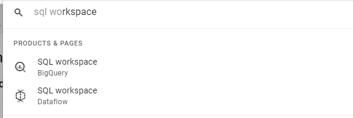
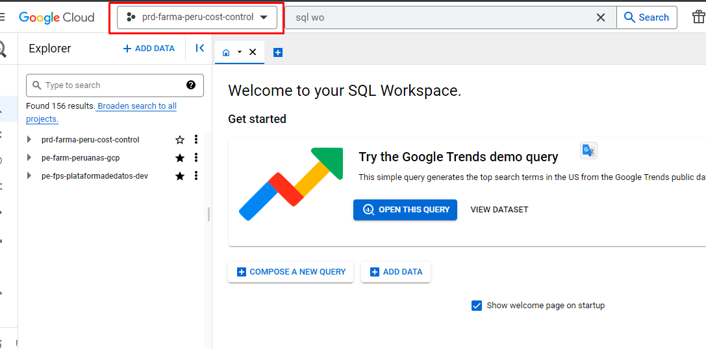

# Taller Bigquery

Abrir el servicio de bigquey.

Aparecerá la siguiente pantalla, Verificar que estemos en el proyecto prd-farma-peru-cost-control.

Clonaremos el repositorio de Github en Cloud Shell.

Ejecutar el siguiente comando en el terminal de linux.

	git clone https://github.com/luisgradossalinas/taller-gcp-dataplatform-04
	
Se nos pedirá nuestro usuario y nuestro PAT (Personal Access Token).

Veremos que se ha creado una carpeta en Cloud Shell, creamos una variable para usarla en el terminal de Cloud Shell.

	export PROJECT_ID=TUPROJECTID
	
Ejecutar.

	gcloud config set project $PROJECT_ID

Ejecutar en Cloud Shell (habilitará  algunos servicios).

	gcloud services enable dataform.googleapis.com \
		secretmanager.googleapis.com \
		cloudfunctions.googleapis.com \
		run.googleapis.com \
		cloudscheduler.googleapis.com \
		workflows.googleapis.com \
		datastore.googleapis.com \
		cloudbuild.googleapis.com \
		firestore.googleapis.com \
		dataplex.googleapis.com \
		sourcerepo.googleapis.com \
		artifactregistry.googleapis.com

Nos vamos al servicio de Firestore, clic en NATIVE MODE.

Seleccionamos la location : name5 (United States)) y clic en Create database.

Regresamos a Cloud Shell y ejecutamos los siguientes comandos, para insertar datos en Firestore.

	cd taller-gcp-dataplatform-04
	pip3 install google-cloud-firestore pandas
	python3 datastore/load_rows_datastore.py

Se realiza la inserción de 7 registros en Firestore en una colección.

Validamos que los registros se hayan insertado, nos vamos al servicio de Firestore.

Fork al repo de Github : https://github.com/luisgradossalinas/dataform-elt-ecommerce-gcp

Clic en Create fork.

Copiamos la url del repo (https://github.com/TU_USUARIO/dataform-elt-ecommerce-gcp).

Crear los recursos desde Terraform.

    cd iac
    terraform init
    
Pegamos el siguiente comando en un txt.

    terraform apply -var="project=$PROJECT_ID" -var="pat_github=REEMPLAZA_TU_PAT" -var="repo_url=TU_URL_REPO_GITHUB"

Una vez modificado, lo ejecutamos en Cloud Shell.

Copiamos el valores de las variables de salida en un txt, lo usaremos en pasos siguientes.

Subir los archivos csv a cloud storage desde un bash ejecutado desde Cloud Shell.

    cd ..
	wget https://datalake-fashionstore.s3.amazonaws.com/data_gcp/distribution_centers/distribution_centers.csv -P data
	wget https://datalake-fashionstore.s3.amazonaws.com/data_gcp/events/events.csv -P data
	wget https://datalake-fashionstore.s3.amazonaws.com/data_gcp/inventory_items/inventory_items.csv -P data
	wget https://datalake-fashionstore.s3.amazonaws.com/data_gcp/order_items/order_items.csv -P data
	wget https://datalake-fashionstore.s3.amazonaws.com/data_gcp/orders/orders.csv -P data
	wget https://datalake-fashionstore.s3.amazonaws.com/data_gcp/products/products.csv -P data
	wget https://datalake-fashionstore.s3.amazonaws.com/data_gcp/users/users.csv -P data

Copiamos el valor de la variable de salida : command_output y lo ejecutamos en Cloud Shell, este comando subir los archivos csv en Cloud Storage.

    sh loadgcs/SH_Load_GCS.sh TU_PROJECT_ID TU_BUCKET

Crear tablas en BigQuery, abrimos y copiamos el contenido del archivo sql/script.sql

Lo pegamos en el Editor de BigQuery y clic en RUN.

## Cloud Functions

Nos vamos al servicio de Cloud Functions, y clic en **fnc-read-gcs-write-bigquery**.

Clic en TESTING.

Clic en TEST IN CLOUD SHELL.

Le damos enter, para ejecutar la Functions (tomará menos de 2 minutos.

Nos vamos a BigQuery, para validar que efectivamente las tablas estén pobladas.

Nos ubicamos en la tabla distribution_centers, y le damos PREVIEW.

Luego de validar los datos de las 7 tablas, ejecutamos el siguiente comando, porque la functions será ejecutada desde un workflow.

    TRUNCATE TABLE ecommerce_bronze.distribution_centers;
    TRUNCATE TABLE ecommerce_bronze.events;
    TRUNCATE TABLE ecommerce_bronze.inventory_items;
    TRUNCATE TABLE ecommerce_bronze.order_items;
    TRUNCATE TABLE ecommerce_bronze.orders;
    TRUNCATE TABLE ecommerce_bronze.products;
    TRUNCATE TABLE ecommerce_bronze.users;

## Dataform

Nos vamos al servicio de Dataform, veremos un repo llamado **dataform-ecommerce**.

Nos vamos al servicio de IAM, para brindar un permiso para que Dataform pueda obtener el valor almacenado del Secret Manager.

Buscamos el service account usado en Dataform y le asignamos el rol Secret Manager Secret Accessor y BigQuery Admin.

Clic en SAVE.

Volvemos a Dataform, clic el repo dataform-ecommerce y clic en CREATE DEVELOPMENT WORKSPACE, con el nombre de dev.

Entrar al archivo dataform.json, reemplazamos el valor TUIDPROYECTO, por el nuestro.

Clic en COMMIT 2 CHANGES y agregamos un comentario sobre el cambio, clic en COMMIT.

Clic en PUSH TO REMOTE BRANCH.

Ejecutamos el proyecto de Dataform, y se crearán tablas en los dataset de bigquery silver y gold.

## Workflows

Nos vamos al servicio de Workflows y le damos a workflow-ecommerce, clic en EXECUTE.

Clic en EXECUTE.

Veremos que se está ejecutando el Workflow (Primero se ejecuta el Cloud Functions y luego el proyecto en Dataform)

Ir de nuevo a Dataform y en la pestaña EXECUTIONS veremos que se ha ejecutado las transformaciones en SQL en BigQuery.

Nos vamos a BigQuery y veremos que existen tablas en los dataset : ecommerce_silver y ecommerce_gold

## Cloud Scheduler

Ir al servicio de Cloud Scheduler, veremos uno que dice **scheduler-workflow-ecommerce**.

## Dataplex

Ir al servicio de Dataplex y seleccionamos los Datasets :

	ecommerce_bronze
	ecommerce_silver
	ecommerce_gold
	

Seleccionamos la tabla : sales_by_product

Clic en LINAEGE.

## Looker Studio

Ir a la siguiente url : https://lookerstudio.google.com

Crear un gráfico en Looker, clic en Crear Fuente de datos.

Seleccionamos BigQuery.

Seleccionamos la tabla sales_by_day y clic en CONECTAR.

Clic en CREAR INFORME.

Aparecerá la siguiente pantalla.

Clic en Añair un gráfico - Gráfico de columnas.

Aparecerá el siguiente gráfico.

Definimos como métrica el campo : revenue.

