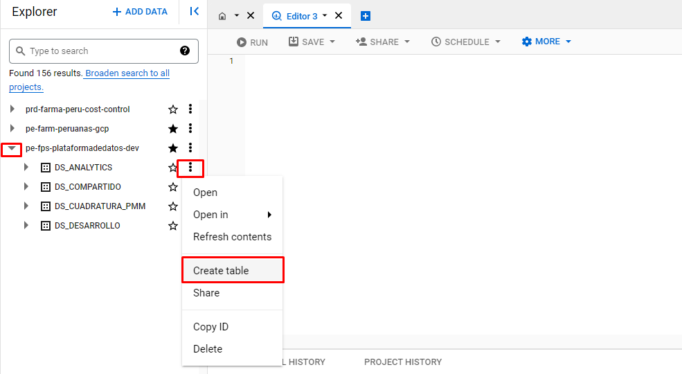
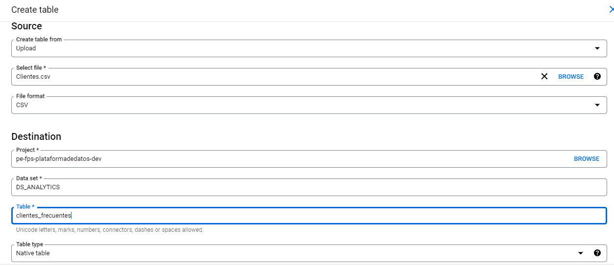
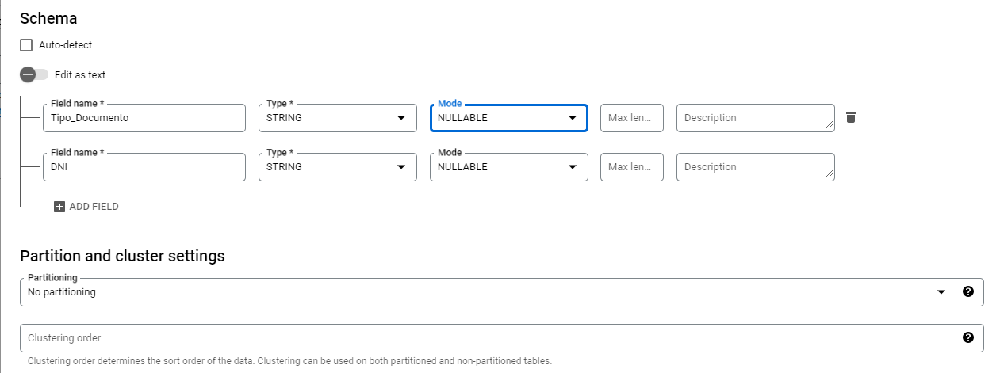
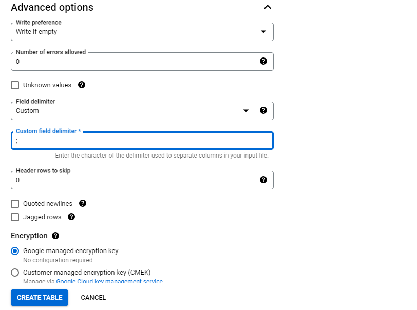
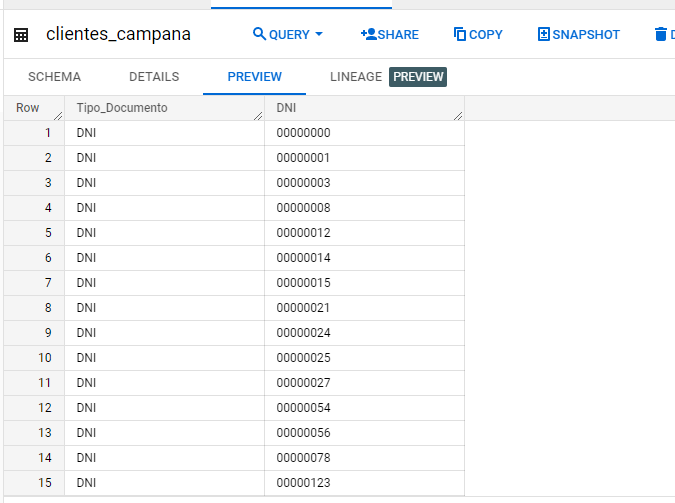
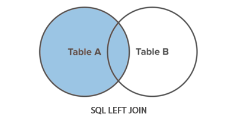

# Taller Bigquery

Abrir el servicio de bigquey.

Aparecerá la siguiente pantalla, Verificar que estemos en el proyecto prd-farma-peru-cost-control.

Clic en COMPOSE A NEW QUERY.

## Carga de datos

Desglosamos el proyecto pe-fps-plataformadedatos-dev y seleccionamos el proyecto donde almacenaremos la tabla:

Es SOURCE, cambiamos el valor de "create table from" a "upload", clic en browse y buscamos el archivo que queremos cargar.

En proyect ponemos pe-fps-plataformadedatos-dev, configuramos el dataset y en "table" ponemos el nombre que le queremos asignar a nuestra tabla.

Schema, usamos solo la opción "auto detect" si el tipo de datos de las columnas estan bien definidas, como en el archivo se tiene el campo DNI bigquery podria detectarlo como integer y quitar el 0 delante, por eso definimos el tipo de columna manualmente.

Desglosamos "Advanced options" y definimos el tipo de delimitador del archivo. Posteriormente le damos en "CREATE TABLE"

¡Ya creamos nuestra primera tabla!

## Querys

Ejemplo 1 : VENTA_FAPE promedio agrupado por ENFERMEDAD

		select ENFERMEDAD,AVG(VENTA_FAPE)  AS VENTA_FAPE FROM pe-fps-plataformadedatos-dev.DS_ANALYTICS.MAPEO_CLIENTES_CI
		GROUP BY 1

Ejericio 1:
Paso1 Calcular el promedio de MARGEN_FAPE, cantidad distinta de clientes, mínimo y maximo de TRAX_FAPE agrupado por segmento de interes
	
Paso2 Filtrar los segmentos de interes con promedio de MARGEN_FAPE mayor a 50.
	
Ejemplo 2 : Excluir  la columna DPTO_MF y agregar un factor de ajuste de 1 sol al margen_fape

		WITH BASE_EXCLUIDO AS (
		SELECT  *EXCEPT(DPTO_MF) FROM 
		pe-fps-plataformadedatos-dev.DS_ANALYTICS.MAPEO_CLIENTES_CI
		)

	        SELECT *REPLACE(MARGEN_FAPE +1  AS MARGEN_FAPE) FROM BASE_EXCLUIDO

Ejericio 2: Excluir las columnas DPTO_IF, PROV_IF, DIST_IF, DPTO_MF, PROV_MF, DIST_MF y agregar un factor de descuento a VENTA_FAPE de 5 soles.

Ejemplo 3: Obtener el número de contacto para Inkafarma y Mifarma de los clientes muy alto valor y Bajo Valor activos en Fape

Conceptos previos:

Left Join: Devuelve todas las filas de la tabla de la izquierda y las filas coincidentes

CASE: La expresión CASE recorre las condiciones y devuelve un valor cuando se cumple la primera condición. Así, cuando una condición es verdadera, deja de leer y devuelve el resultado. Si no se cumple ninguna condición, devuelve el valor de la cláusula ELSE.

ROW_NUMBER() : Asigna un número secuencial único a cada fila en el conjunto de resultados de una consulta

PARTITION BY

Divide el conjunto de resultados producido por la cláusula FROM en particiones a las que se aplica la función ROW_NUMBER

La ORDER BY

cláusula determina la secuencia en la que a las filas se les asigna su único ROW_NUMBERdentro de una partición específica.
 
Ejecutar el siguiente comando en el consulta de bigquery.

	
		WITH CELULAR_INKAFARMA AS (
		SELECT NRODOCUMENTO, NRO_CELULAR_E
		    FROM (
		      SELECT NRODOCUMENTO, NRO_CELULAR_E, ROW_NUMBER() OVER(PARTITION BY NRO_CELULAR_E ORDER BY PUNTUACION DESC, FECHA_REGISTRO DESC) PUESTO
		      FROM (
			SELECT  NRODOCUMENTO, NRO_CELULAR_E, PUNTUACION,FECHA_REGISTRO,
			  ROW_NUMBER() OVER(PARTITION BY NRODOCUMENTO ORDER BY PUNTUACION DESC, FECHA_REGISTRO DESC) PUESTO
			FROM (
			  SELECT DISTINCT NRODOCUMENTO, NRO_CELULAR_E,
			    CASE WHEN COD_FUENTE IN ('F06') THEN 6 --'1. Agora Club'
			      WHEN COD_FUENTE IN ('F03.1','F03.2') THEN 5 --'2. ECOMMERCE'
			      WHEN COD_FUENTE IN ('F02.1','F02.2') THEN 4 --'3. LANDING'
			      WHEN COD_FUENTE IN ('F05') THEN 3 --'4. GDH'
			      WHEN COD_FUENTE IN ('F04') THEN 2--'5. FINANCIERA OH'
			  ELSE 1 --'6. MESON'
			  END PUNTUACION, FECHA_REGISTRO
			  FROM `pe-farm-peruanas-gcp.DS_ANALYTICS.CONTACTABILIDAD_CELULAR5_INKAFARMA`
				)
			  ) WHERE PUESTO = 1
		    ) WHERE PUESTO = 1
		)

		,

		CELULAR_MIFARMA AS (
		    SELECT NRODOCUMENTO, NRO_CELULAR_E
		    FROM (
		      SELECT NRODOCUMENTO, NRO_CELULAR_E, ROW_NUMBER() OVER(PARTITION BY NRO_CELULAR_E ORDER BY PUNTUACION DESC, FECHA_REGISTRO DESC) PUESTO
		      FROM (
			SELECT  NRODOCUMENTO, NRO_CELULAR_E, PUNTUACION,FECHA_REGISTRO,
			  ROW_NUMBER() OVER(PARTITION BY NRODOCUMENTO ORDER BY PUNTUACION DESC, FECHA_REGISTRO DESC) PUESTO
			FROM (
			  SELECT DISTINCT NRODOCUMENTO, NRO_CELULAR_E,
			    CASE WHEN COD_FUENTE IN ('F06') THEN 6 --'1. Agora Club'
			      WHEN COD_FUENTE IN ('F03.1','F03.2') THEN 5 --'2. ECOMMERCE'
			      WHEN COD_FUENTE IN ('F02.1','F02.2') THEN 4 --'3. LANDING'
			      WHEN COD_FUENTE IN ('F05') THEN 3 --'4. GDH'
			      WHEN COD_FUENTE IN ('F04') THEN 2--'5. FINANCIERA OH'
			  ELSE 1 --'6. MESON'
			  END PUNTUACION, FECHA_REGISTRO
			  FROM `pe-farm-peruanas-gcp.DS_ANALYTICS.CONTACTABILIDAD_CELULAR5_MIFARMA`
				)
			  ) WHERE PUESTO = 1
		    ) WHERE PUESTO = 1
		)

		SELECT DISTINCT ID_CLIENTE,A.NRO_CELULAR_E AS CELULAR_INKAFARMA, B.NRO_CELULAR_E AS CELULAR_MIFARMA FROM pe-fps-plataformadedatos-dev.DS_ANALYTICS.MAPEO_CLIENTES_CI
		LEFT JOIN CELULAR_INKAFARMA AS A ON ID_CLIENTE=A.NRODOCUMENTO
		LEFT JOIN CELULAR_MIFARMA AS B ON ID_CLIENTE=B.NRODOCUMENTO
		WHERE ACTIVO_FAPE="Si" AND SEG_VALOR IN ("Medio valor","Bajo valor")
	

Ejercicio 3 : Traer el email para Inkafarma y Mifarma

Inkafarma: pe-farm-peruanas-gcp.DS_ANALYTICS.CONTACTABILIDAD_EMAIL6_INKAFARMA

Mifarma: pe-farm-peruanas-gcp.DS_ANALYTICS.CONTACTABILIDAD_EMAIL6_MIFARMA

